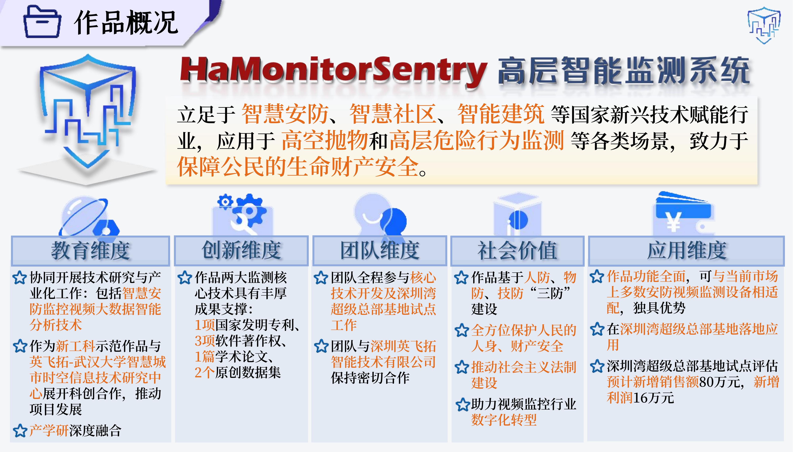
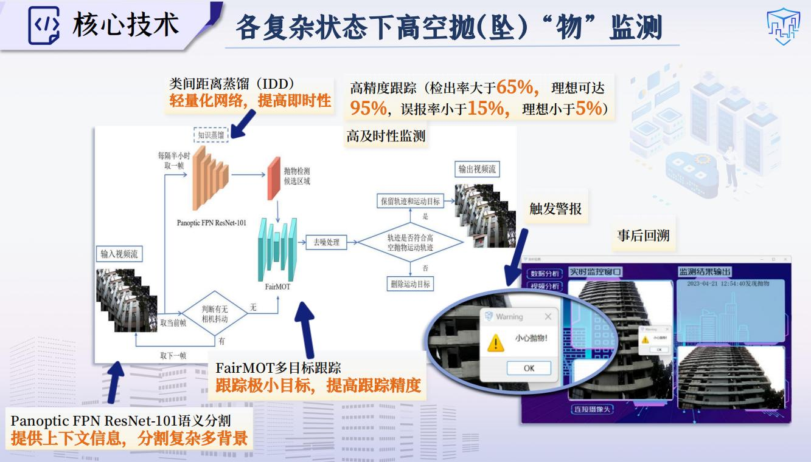

# HaMonitorSentry 高层智能监测系统

> 第17届中国大学生计算机设计大赛 人工智能应用-人工智能实践赛 作品

> **HaMonitorSentry** 是专为高层建筑和人群密集区设计的高级智能安防系统。该系统结合高分辨率、高帧率摄像技术和双角度监测策略，适用于智慧安防、智慧社区和智能建筑等行业，致力于与物业、企业、政府合作，以保障公民的生命和财产安全。
>
> 可访问 [作品主页](https://mumuyeye.github.io/HaMonitorSentry/README.html)。

&nbsp;&nbsp;&nbsp;&nbsp;我们立足于 **智慧安防**、**智慧社区**、**智能建筑** 等国家新兴技术赋能行业，应用于 **高空抛物** 和 **高层危险行为监测** 等各类场景，致力于保障公民的生命财产安全。



- 有数据显示，我国近三年来高层事故数量**连年增长**，这些触目惊心的数字警示着我们正面临着的**严峻的社会安防威胁**；
- 但同时，令人振奋的是，国家已**发布多项政策**，来支持我国智能安防的建设与发展；
- **公共安全领域投入也逐步扩大**，总体呈现逐步增长之势，智能安防行业市场规模也持续增长；
- 我们总结了目前仍然难以解决的社会痛点和技术痛点：
  - 高空事故发生前**无法及时警示**有关主体
  - 存在着“**取证难、判定难、定罪难**”的困境
  - **民众**仍对高空抛物事故的发生**心存侥幸**
  - 当前技术在处理复杂监测场景时存在挑战：**准确性弱、鲁棒性差、实时性弱、未针对优化**。
  - 当今市面上现有的高层监测设备大多**功能狭窄、数据不全、场景局限、监测欠佳**。
- 故可见，现有措施和设备均**无法良好地满足智能安防的要求以全方位保护人民生命财产安全**!


&nbsp;&nbsp;&nbsp;&nbsp;因此，我们设计了对应的解决方案——一套提供足够威慑力、有效监督民众违法行为、保障民众生命财产安全的**高层智能监测系统**。


&nbsp;&nbsp;&nbsp;&nbsp;与现有产品对比，我们将**多算法相互结合**，**功能全面**，在高层智能监测领域**独具优势**。


### 核心功能

#### 高空抛/坠物监测

- 系统的第一个核心是高空抛/坠“物”监测。
- 采用 Panoptic FPN ResNet-101 语义分割技术 提取建筑物背景并使用类间距离蒸馏，并对运动对象进行去噪处理，同时引入 MA 模块，加速信息流动效率。
- 最终使得高空抛物检出率稳定在 65% 以上，误报率小于 15%，理想情况下检出率可达 95%，误报率小于 5%。



#### 高层建筑边缘危险行为监测

- 第二个核心是高层建筑物边缘侧“人”的危险行为监测。
- 在同一个网络中融合时序信息和空间信息，捕捉视频中的动态行为和时间依赖特征，通过多头注意力和前馈网络处理。
- 最终使得人体检测率大于 70%，行为及危险系数确认误识率小于 15%，理想情况下检测率可达 95%，误报率小于 5%。


### 数据集构建与开源

&nbsp;&nbsp;&nbsp;&nbsp;我们构建了高质量 [高空抛物检测原创数据集](https://pan.baidu.com/s/12ACPttrbEMglgN6v_PanEw?pwd=2333) ，涵盖丰富的场景及多样的抛物类别


&nbsp;&nbsp;&nbsp;&nbsp;以及高质量 [高层危险行为原创数据集](https://pan.baidu.com/s/12ACPttrbEMglgN6v_PanEw?pwd=2333) ，同样涉及丰富场景和多样的动作类别


### 系统实现

&nbsp;&nbsp;&nbsp;&nbsp;坚持双重监测角度，同时实现一体化通信和数据治理的交叉融合。


### 产学研一体

&nbsp;&nbsp;&nbsp;&nbsp;目前基于本作品已落实1项专利、3项软著、1篇学术论文以及2个原创数据集。


&nbsp;&nbsp;&nbsp;&nbsp;本作品由深圳英飞拓智能技术有限公司提供硬件支持，促进应用研发过程。


&nbsp;&nbsp;&nbsp;&nbsp;同时，本系统于深圳湾超级总部基地及其他多个园区进行落地试点，具备广泛社会效益与显著科技示范效益。


## 系统运行环境

- **操作系统**: Ubuntu 20.04.3 LTS (Focal Fossa)

## 配置环境包

```bash
git clone https://github.com/mumuyeye/HaMonitorSentry.git
cd HaMonitorSentry
conda env create -f environment.yml
conda activate sentry
```

## 系统显示字体安装

```bash
# 创建字体目录（如果尚未存在）
mkdir -p ~/.local/share/fonts
# 复制字体文件
cp /root/sentry/HaMonitorSentry/MSYH.TTF ~/.local/share/fonts/
# 更新字体缓存
fc-cache -fv
# 验证字体是否安装成功
fc-list | grep "MSYH"
```

## 数据集示例

&nbsp;&nbsp;&nbsp;&nbsp;如需下载 HaMonitorSentry 所使用的数据集示例，访问 [百度网盘链接](https://pan.baidu.com/s/12ACPttrbEMglgN6v_PanEw?pwd=2333) 并使用提取码 `2333` 进行下载。

## 运行系统

```bash
python demo.py
```


---


**驭科技以守护，持创新以护航**，HaMonitorSentry 高层智能监测系统定会成为 **智能安防，平安中国** 之船的重要组成部分，载着人民共同渡往安全幸福的彼方。
