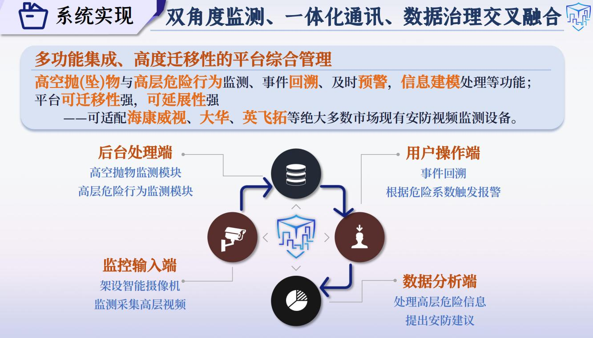

# HaMonitorSentry 高层智能监测系统

> **HaMonitorSentry** 是专为高层建筑和人群密集区设计的高级智能安防系统。该系统结合高分辨率、高帧率摄像技术和双角度监测策略，适用于智慧安防、智慧社区和智能建筑等行业，致力于与物业、企业、政府合作，以保障公民的生命和财产安全。
>
> 可访问 [作品主页](https://github.com/mumuyeye/HaMonitorSentry/README.html)。


我们立足于 **智慧安防**、**智慧社区**、**智能建筑** 等国家新兴技术赋能行业，应用于 **高空抛物** 和 **高层危险行为监测** 等各类场景，致力于保障公民的生命财产安全。


### 核心功能

#### 高空抛/坠物监测

系统采用 **Panoptic FPN ResNet-101 语义分割技术** 提取建筑物背景并使用类间距离蒸馏，同时对运动对象进行去噪处理。引入 MA 模块，加速信息流动效率，使高空抛物检出率稳定在 **65%** 以上，误报率小于 **15%**，理想情况下检出率可达 **95%**，误报率小于 **5%**。


#### 高层建筑边缘危险行为监测

融合时序信息和空间信息，捕捉视频中的动态行为和时间依赖特征，通过多头注意力和前馈网络处理，使人体检测率大于 **70%**，行为及危险系数确认误识率小于 **15%**，理想情况下检测率可达 **95%**，误报率小于 **5%**。


### 数据集建设

我们构建了高空抛物检测原创数据集，涵盖多个场景、多种抛物类别；以及高层危险行为原创数据集，涉及多个场景、多个动作类别。



### 系统实现

坚持双重监测角度，同时实现一体化通信和数据治理的交叉融合。


### 硬件支持

本作品由 **深圳英飞拓智能技术有限公司** 提供硬件支持，促进应用研发过程。计划将该系统应用于深圳湾超级总部基地及其他多个园区，实现落地试点，带来广泛的社会效益和显著的科技示范效益。

---

## 系统运行环境

- **操作系统**: Ubuntu 20.04.3 LTS (Focal Fossa)

## 配置环境包

```bash
git clone https://github.com/mumuyeye/HaMonitorSentry.git
cd HaMonitorSentry
conda env create -f environment.yml
conda activate sentry
```

## 系统显示字体安装

```bash
# 创建字体目录（如果尚未存在）
mkdir -p ~/.local/share/fonts
# 复制字体文件
cp /root/sentry/HaMonitorSentry/MSYH.TTF ~/.local/share/fonts/
# 更新字体缓存
fc-cache -fv
# 验证字体是否安装成功
fc-list | grep "MSYH"
```

## 数据集示例

如需下载 HaMonitorSentry 所使用的数据集示例，访问 [百度网盘链接](https://pan.baidu.com/s/12ACPttrbEMglgN6v_PanEw?pwd=2333) 并使用提取码 `2333` 进行下载。

## 运行系统

```bash
python demo.py
```

---


**驭科技以守护，持创新以护航**，HaMonitorSentry 高层智能监测系统定会成为 **智能安防，平安中国** 之船的重要组成部分，载着人民共同渡往安全幸福的彼方。
